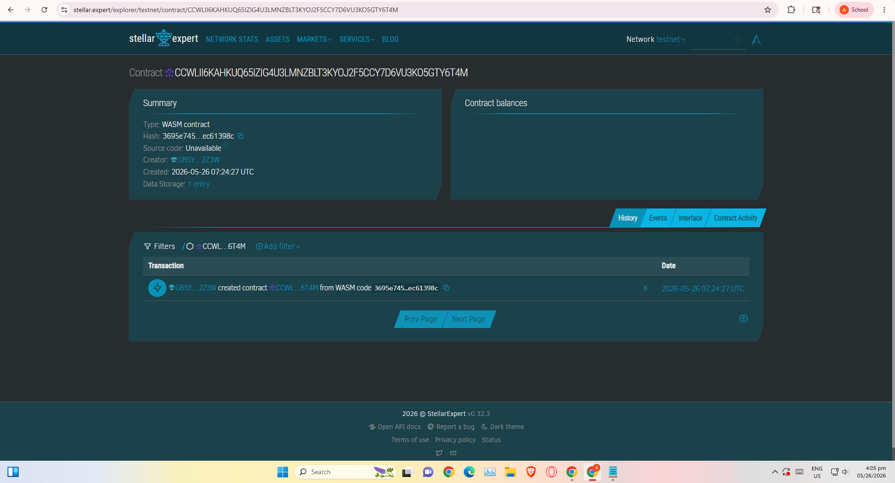

# CaféTrust Escrow

An automated, low-cost supply chain settlement engine for smallholder coffee cooperatives and producers.

## Problem & Solution
Coffee farmers in Huehuetenango lose critical operational margins to intermediary brokers due to lack of payment security guarantees. CaféTrust secures agreements dynamically on-chain using Soroban contracts; buyers lock USDC tokens that instantly clear directly into the farmer's wallet immediately upon digital crop receipt confirmation.

## Timeline & Architecture
* **Hackathon Target:** MVP execution under 2 minutes.
* **Smart Contracts:** Soroban / Rust WebAssembly
* **Token Layer:** Stellar Native Asset Interoperability (USDC)

## Stellar Features Used
* **Soroban Smart Contracts:** Houses agreement execution logic.
* **Asset Interoperability:** Uses ecosystem native USD Coin (USDC) tokens for payments.
* **On-Chain Authentication:** Leverages granular native signature checking via `require_auth()`.

## Prerequisites
* Rust v1.75+
* Soroban CLI installed globally

## Getting Started

### How to Build
## Contract ID:CCWLII6KAHKUQ65IZIG4U3LMNZBLT3KYOJ2F5CCY7D6VU3KO5GTY6T4M
## Contract Link:https://stellar.expert/explorer/testnet/contract/CCWLII6KAHKUQ65IZIG4U3LMNZBLT3KYOJ2F5CCY7D6VU3KO5GTY6T4M


```bash
soroban contract build
